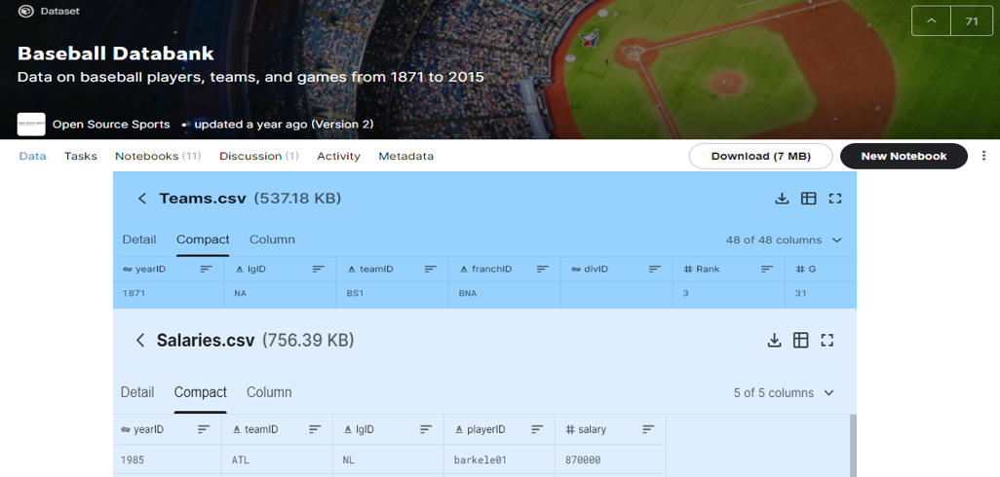

# 
 Project 2: Group C

## <b>
Do higher MLB player salaries lead to greater team success?
</b>

An analysis of MLB team salary data from 1985-2015 was investigated to determine if the highest spending teams achieve the greatest levels of success. Relationships considered will include:
-	Cost/Win for each team per season -> total team salary/wins.
-	Mean league Cost/Win per season -> total league salaries/total league wins
-	Cost/Win for each year’s championship team vs. League median cost per win.

### Process: 
- [x] Concept design and project planning.
- [x] Create Github Repository.
- [x] Evaluate and obtain data sources.
- [ ] Create SQL database to archive data.
- [ ] Develop a Python Flask application to create API's enabling users to explore data. 
- [ ] Generate a website with instructions for users to access API's and website content.
- [ ] Design additional web pages containing analysis, charts, interactive experiences, and data allowing users to investigate correlations between team salaries and outcomes.

### Resources:
-	HTML/CSS
-	JavaScript
-	SQL
-	Python

### Data Sources:
	
   1. [Kaggle:Baseball Databank](https://www.kaggle.com/open-source-sports/baseball-databank?select=HallOfFame.csv)
      
      Baseball Databank is a compilation of historical baseball data in aconvenient, tidy format, distributed under Open Data terms.
      This version of the Baseball databank was downloaded from [Sean Lahman's website](http://www.seanlahman.com/baseball-archive/statistics/). Data sets employed were:
      +  [Teams.csv](https://www.kaggle.com/open-source-sports/baseball-databank?select=Teams.csv) (537 KB, Total columns available: 48)
      +  [Saleries.csv](https://www.kaggle.com/open-source-sports/baseball-databank?select=Salaries.csv) (756 KB, Total columns available: 5)
        		
	

	
	
	
   2. *Additional sources TBD	

### Charts: 
-	Scatterplot showing average team cost per win/per season.
-	Bubble chart representing all 30 champions (from 1985-2015). 
-	Size of bubbles will be representative of championship cost/ team win in relation to league mean of cost/team win.

	
### Questions to be answered:
1.	What was the average cost per team win based on total salaries each season?
2.	How often did yearly champions spend above or below the league mean per win?

